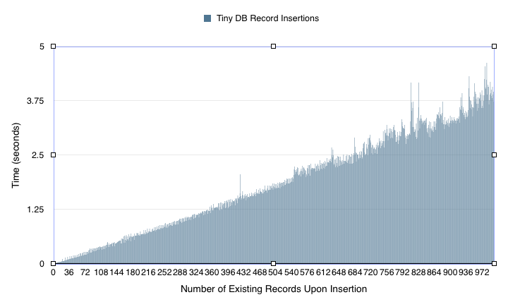

# Homework B: Viability Testing for TinyDB Conclusion
#### Drew Guarnera & Heather Michaud

A development team requires a database for a small store. The database could
have up to 1,000 customers with each customer having a purchase history of
approximately 500 items. For this task, the development team suggests the
python package [TinyDB](https://github.com/msiemens/tinydb) be used as the
document based database engine. The mission of the viability test is to assess
the potential of using TinyDB for the purposes of a small store customer
database.

### Procedure
The viability testing for the TinyDB database engine was performed using Python
version 3.5.0, TinyDB version 2.4, and ujson version 1.33 (for optimized json
support in TinyDB). Timing data was collected for all basic database operations
add new data (insert), modify existing data (update), delete data (remove). Each
of these operations are tested on a very small TinyDB database to verify that
the operations are possible to perform. These tests consist of a very basic
and streamlined version of a customer database featuring only two records at the
start of each test in the following format.

``` json
[
  {
    "customerid": 1,
    "items": [
      {"name": "raspberry pi", "price": 30},
      {"name": "pi case", "price": 8}
    ]
  }
]
```


These tests are repeated again on a very large TinyDB database containing more
complex mock customer, order, and item data like the example below to help
evaluate TinyDB's performance.

``` json
[
  {
    "cust_id": "3ae8a9f7-0f54-498b-8e89-b8fe7e43a8a9",
    "cust_name": "Fuelworks",
    "orders": [
      {
        "order_id": "d8a40a2b-facc-4d0a-8b0f-32a4e9d7080c",
        "order_date": "2014-05-08",
        "items": [
          {
            "item_id": "fce48268-0b4c-4fba-994f-03174ab9c9a0",
            "item_name": "dolor",
            "item_qty": 80,
            "item_cost": "$129.78"
          }
        ]
      }
    ]
  }
]
```

The mock dataset consists of 1,000 customer records each containing 50 orders
with each order holding 10 items each. This dataset was generated by
http://www.json-generator.com/ using the following generation script.

```
[
  '{{repeat(100)}}',
  {
    cust_id: '{{guid()}}',
    cust_name: '{{company()}}',
    orders: [
      '{{repeat(50)}}',
      {
        order_id: '{{guid()}}',
        order_date: '{{date(new Date(2014, 0, 1), new Date(), "YYYY-MM-dd")}}',
        items: [
          '{{repeat(10)}}',
          {
          item_id: '{{guid()}}',
          item_name: '{{lorem(1, "words")}}',
          item_qty:  '{{integer(1, 100)}}',
          item_cost: '{{floating(1, 200, 2, "$0.00")}}'
          }
          ]
      }
      ]
  }
 ]
```

This data set meets the proposed upper bound storage capacity required by the
development team and is all contained in one TinyDB table.

All of the operations on the database are tested and validated using the
internal Python unittest module, and timing data is stored in a separate csv to
assess the approximate latency of all the operations using the Python time
module. To help put both the timing performance and relative convenience of
operations of TinyDB into perspective, the sqlite3 python module was also used
in a mirrored set of tests against a large dataset. In an effort to make the
performance tests fair between sqlite3 and TinyDB, all the records are stored
flat in one table generated using the following SQL command.

``` sql
CREATE TABLE orders
(cust_id text, cust_name text, order_id text, order_date date, item_id text,
  item_name text, item_qty real, item_cost real)
```

The resulting sqlite3 table contains 500,000 records all populated with the same
data from the mock dataset. Since it is assumed that large databases will task
the respective engines (sqlite3 and TinyDB) more than small record sets, only
the large scale tests will be replicated with sqlite3 as a basis for comparison
between the two engines.

### Testing
The following section introduces the set of tests used to provide evidence of
TinyDB's viability as a database engine for a customer database. Since there are
17 tests for this viability test, the descriptions and results will be
grouped together by the activity or performance timing indicator. Each test
includes a basic description of the test itself, and the results of the test.
For simplicity, all mentions in the tests referring to a "small database" refers
to the simple data shown above, while "big database" refers to the large 1,000
customer record mock database. Additionally, when the number of lines of code
(LOC) required to perform any task is presented this refers to number of
statements.This means if one statement spans multiple lines in the text
document, it still only constitutes one line of code. It should also be noted
that the small database and big database tests are separate, but once again,
for brevity and since they cover similar operations they are both covered in the
general test categories below.

#### Add Record
This test is used to evaluate that sqlite3 and TinyDB are capable of adding a
new record to a dataset. Both the small database and big database add a single
customer record complete with items (and orders in the case of the big database)
to the database. This test corresponds specifically to the requirements:
*An element can be added to the database*
*Adding element takes less than 0.05 seconds*
*Add, view, and delete can be performed in less than one LOC*

When dealing with the small database, TinyDB was very capable of
adding a new customer record into a database and with a speedy performance
time of 0.0002 seconds. Additionally, the code required to make the change to
the database and can be done in one line of code. However when it came to
running the add record test on the big database, the insertion time for TinyDb
increased drastically to 3.7235 seconds. For the sqlite3 version of this both
the inserts for the big database only took 0.0007 and only required one
additional line of code (two total) to "commit" the change to the database.

#### Add Item to Record
This test attempts to add existing data content to an existing record. For
example, adding another item, or order, to an existing customer record. Both the
small and big database add an item to a customer record, while the big database
additionally adds a new order (including items) into a customer record. This
test corresponds specifically to the requirements:
*An element can be added to an item within the database*
*Adding element takes less than 0.05 seconds*
*Add, view, and delete can be performed in less than one LOC*

TinyDB handled the small database item took only 0.0001 seconds to execute and
four lines of code. The big database test took significantly longer with
addition of a new item required 4.0842 seconds and adding an order to the
customer record (items included) took 5.5983 seconds. The lines of code also
increased to eleven lines for the item addition and four lines of code for the
order addition. The sqlite version is able to add an item to a record in
the big database in only 0.0007 seconds while still only requiring only two
lines of code.

#### Update Item in Record
This test is used to evaluate the capabilities of the database engines to update
information in the database. This differs from add operations in that add new
data content into the database while the update only changes the value of
existing database record content. For both the small and big databases, only one
field is located and updated in the record. In order to preform this operation,
it is necessary that the database engine provide a means to access data fields
or elements of the database. This test corresponds specifically to the
requirements:
*An element can be retrieved from the database*
*Accessing an element takes less than 0.01 seconds*
*Add, view, and delete can be performed in less than one LOC*

Once again, for the small database, TinyDB took 0.0001 seconds to access the
information. However, to collect and update the record required seven lines of
code. When tasked with a big database, access to a record took 1.5162 seconds
and took ten lines of code to access the item. The sqlite3 database on the other
hand only took two lines of code to accomplish the update task and did so in
only 0.1572 seconds.

#### Remove Item in Record
This test ensures that it is possible to remove specific pieces of information
contained within a record. Removals for both the small and big databases refers
to the removal of a complete item subset. For example it would not make sense to
just remove an item's identification number, price, or quantity and leave the
rest of the information in the database. This test instead focuses on the
removal of a complete item and its related fields, or an order and its related
fields as well as all items it contains. This test corresponds specifically to
the requirements:
*An element can be removed from any location within the database*
*Deleting an element takes less than .1 seconds*
*Add, view, and delete can be performed in less than one LOC*

Using TinyDB with a small database, an item removal was able to be accomplished
in only 0.0001 seconds using nine lines of code. For the big database, TinyDB
required twelve lines of code and took 5.4676 seconds to remove an item from
an order while removal of an order and its items required ten lines of code and
took 5.6194 seconds. Sqlite3 on the other hand was able to delete an item in
0.1659 seconds and required two lines of code to perform the operation.

#### Remove a Record
This test is used to evaluate the ability to remove top level record data from
the database. This differs from the previous "Remove Item in Record" test
category as it is a top level removal which for the purposes of this database
would be a customer record and all its associated order and item records as
well. This test corresponds specifically to the requirements:
*An element can be removed from any location within the database*
*Deleting an element takes less than .1 seconds*
*Add, view, and delete can be performed in less than one LOC*

The small database with TinyDB removal of a record took only two lines of code
and 0.0001 seconds. For the big database, TinyDB still only required two lines
of code buy took 5.4708 seconds to perform the operation. Sqlite3 was also able
to perform the record deletion in two lines of code, and took 0.1659 seconds.

#### Record Insertion Performance
While this test is similar to the add record test in that it requires the
database engine to be able to create new records (customer records) into the
database it differs in a few key ways.
  1. This test is only applied to the big database using the mock dataset
  1. This test starts with an empty database and inserts records until the
  maximum number of items is reached
    - For TinyDB, this means 1000 customer records with 50 orders each
    containing 10 items in one table
    - For sqlite3. this means that all the same record information was
    flattened into 500,000 records and inserted into one table
  1. Each insert is timed individually until all insertions are complete
While this may not be the optimal way of storing data in these respective
formats the idea was to keep the test as fair as possible by having each engine
work with a single large table. This means that this data is an approximate
indicator of how each database engines performance scales as more and more
records are added. This test corresponds specifically to the requirements:
*An element can be added to the database*
*A TinyDB can consist of 1,000 elements which have 500 sub-elements*
*Adding element takes less than 0.05 seconds*
*Add, view, and delete can be performed in less than one LOC*

TinyDB was capable of storing the large dataset, however it's performance took
a hit as the size of the database increased. The chart below illustrates this
issue.


